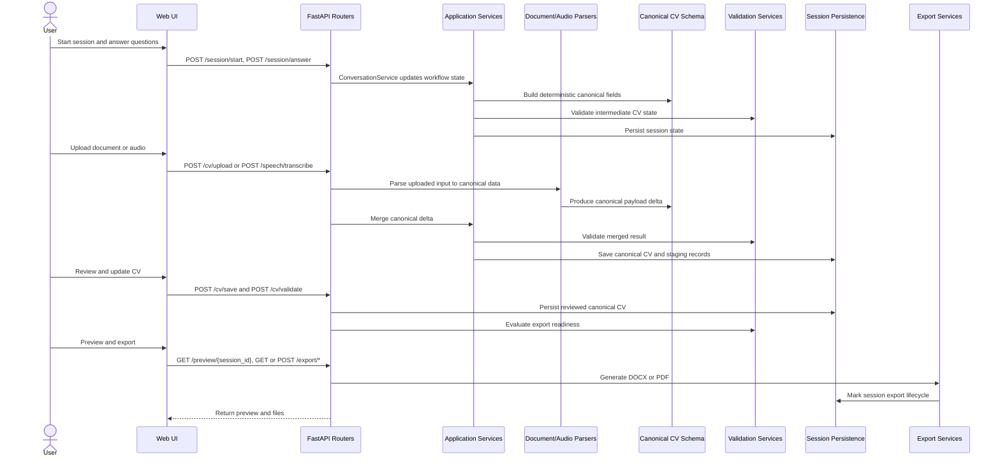

# Conversational CV Builder Automation Platform

> **FastAPI-based intelligent CV builder** with conversational intake, document/audio ingestion, canonical schema merge, validation, preview, and export capabilities. Featuring **zero-data-loss extraction staging layer** and **persistent session management**.

---

## 📋 Table of Contents

1. [Key Features](#-key-features)
2. [Prerequisites & Dependencies](#-prerequisites--dependencies)
3. [Quick Start Guide](#-quick-start-guide)
4. [Project Structure](#-project-structure)
5. [Installation & Configuration](#-installation--configuration)
6. [Running the Project](#-running-the-project)
7. [API Documentation](#-api-documentation)
8. [Data Flow Architecture](#-data-flow-architecture)
9. [Data Persistence & Sessions](#-data-persistence--sessions)
10. [Extraction Staging Layer](#-extraction-staging-layer-new-april-2026)
11. [Deployment](#-deployment)
12. [Testing & Verification](#-testing--verification)
13. [Troubleshooting](#-troubleshooting)
14. [Additional Resources](#-additional-resources)

---

## ✨ Key Features

- **Conversational CV Building**: Guided questioning with role-based follow-up logic
- **Multi-Channel Input**: Document uploads (PDF, DOCX), audio transcription, conversational input
- **Canonical CV Schema**: Unified data model (v1.1) across all input channels
- **Smart Merging**: Intelligent data conflict resolution with field precedence rules
- **Field Confidence Scoring**: Per-field confidence (0.0-1.0) for quality assessment
- **Live Preview**: Real-time CV rendering for user review
- **Export Options**: DOCX and PDF export with custom formatting
- **Session Persistence**: MySQL-backed session storage (zero data loss)
- **Extraction Staging**: Complete audit trail of all extraction stages
- **LLM Enhancement**: Optional transcript enhancement for audio inputs
- **RBAC Security**: Role-based access control with JWT authentication

---

## 📦 Prerequisites & Dependencies

### System Requirements
- **Python**: 3.11+ (validated on Python 3.13)
- **MySQL**: 8.x (for session and extraction persistence)
- **Node.js**: Optional (for web-ui development)

### Core Dependencies
- `fastapi` - Web framework
- `uvicorn` - ASGI server
- `pydantic` & `pydantic-settings` - Data validation
- `python-docx` - DOCX generation
- `PyPDF2` & `reportlab` - PDF handling
- `pytest` - Testing framework
- `alembic` - Database migrations

### Optional Dependencies
- `faiss-cpu` - Vector search (if using native FAISS)
- OpenAI API for LLM features

---

## 🚀 Quick Start Guide

### 1. Clone and Install
```bash
cd "c:\Users\229164\OneDrive - NTT DATA, Inc\AI\cv_builder_automation\cv_builder_automation"
pip install -e .
```

### 2. Configure Environment
```bash
copy .env.example .env
# Edit .env with your configuration:
# - OPENAI_API_KEY
# - DB_HOST, DB_PORT, DB_NAME, DB_USER, DB_PASSWORD
# - SECRET_KEY
# - SESSION_REPOSITORY_BACKEND=mysql
```

### 3. Database Setup
```powershell
$env:PYTHONPATH='.'
$env:SEED_AUTH_PASSWORD='replace-with-strong-password'
python -m alembic -c alembic.ini upgrade head
python scripts/seed_auth_users.py  # Optional: seed pilot users
```

### 4. Start Development Server
```powershell
.\scripts\start_dev.ps1
# or manually:
$env:PYTHONPATH='.'
$env:ENV='dev'
$env:SESSION_REPOSITORY_BACKEND='mysql'
python -m uvicorn apps.api.main:app --host 127.0.0.1 --port 8000 --reload
```

### 5. Access Application
- **Web UI**: http://127.0.0.1:8000/
- **API Docs**: http://127.0.0.1:8000/docs
- **Health Check**: http://127.0.0.1:8000/health

### 6. Test with Seeded User
```bash
# Use seeded username with SEED_AUTH_PASSWORD
# Example: venkata.janga / [your-password]
```

---

## 📁 Project Structure

### Root Directory Structure

```
cv_builder_automation/
├── apps/                          # Application layer
│   ├── api/                       # FastAPI application
│   │   ├── main.py               # App entry point
│   │   ├── bootstrap/            # Startup routines
│   │   └── middleware/           # Custom middleware
│   └── worker/                   # Background job workers (placeholder)
├── config/                        # Configuration files
│   ├── environments/             # ENV-specific configs (dev, prod, uat)
│   ├── prompts/                  # LLM prompts (extraction, enhancement, RAG)
│   ├── questionnaire/            # Q&A engine rules and question bank
│   ├── security/                 # OAuth2, RBAC, token mappings
│   └── templates/                # Export templates and registry
├── src/                          # Core business logic (DDD architecture)
│   ├── ai/                       # AI/LLM integration
│   ├── application/              # Application services
│   ├── domain/                   # Domain models and services
│   ├── infrastructure/           # Database, parsers, external services
│   ├── interfaces/               # REST routers
│   ├── observability/            # Logging and monitoring
│   ├── orchestration/            # Workflow orchestration
│   ├── questionnaire/            # Q&A questionnaire engine
│   ├── retrieval/                # FAISS retrieval and indexing
│   ├── templates/                # Template services
│   └── web/                      # Web utilities
├── tests/                        # Test suite
├── migrations/                   # Alembic database migrations
├── deployments/                  # Deployment configs (Docker, AKS, ACA)
├── docs/                         # Documentation
├── data/                         # Data storage (uploads, sessions)
├── log/                          # Runtime logs
├── scripts/                      # Utility scripts
├── web-ui/                       # Frontend (static, templates)
├── .env.example                  # Environment template
├── alembic.ini                   # Migration config
├── pyproject.toml                # Project metadata and dependencies
├── README.md                     # This file
└── run.py                        # Convenient app launcher
```

### Key Directories Explained

| Directory | Purpose |
|-----------|---------|
| `apps/api/` | FastAPI application with routers and middleware |
| `src/application/` | Business logic services (ConversationService, DocumentCVService, etc.) |
| `src/infrastructure/` | Database, parsers, external integrations |
| `src/domain/` | Core domain models (CVSession, CanonicalCV, etc.) |
| `src/interfaces/rest/routers/` | REST API endpoint definitions |
| `config/` | Runtime configuration, prompts, security settings |
| `migrations/` | Database schema migrations via Alembic |
| `tests/` | Comprehensive test suite |
| `deployments/` | Docker, Kubernetes, ACA deployment manifests |

---

## 🔧 Installation & Configuration

### Environment Configuration

#### File Resolution Order
1. If `ENV=dev` → Load `.env.dev` → fallback to `.env`
2. If `ENV` not set → Load `.env`
3. **Recommendation**: Use `.env.dev`, `.env.uat`, `.env.prod` (never commit real secrets)

#### Required Environment Variables
```env
# API Configuration
SECRET_KEY=your-secret-key-32-chars-minimum

# OpenAI Integration
OPENAI_API_KEY=your-api-key-here
OPENAI_MODEL=gpt-4
OPENAI_EMBEDDING_MODEL=text-embedding-3-small
OPENAI_VERIFY_SSL=true

# Database Configuration
DB_HOST=localhost
DB_PORT=3306
DB_NAME=cv_builder
DB_USER=root
DB_PASSWORD=your-db-password

# Session Persistence
SESSION_REPOSITORY_BACKEND=mysql  # or 'memory', 'file'

# Authentication
TOKEN_EXPIRE_MINUTES=1440

# Optional: Seed pilot users
SEED_AUTH_PASSWORD=your-seed-password
```

### Database Setup for Fresh Environment

```powershell
# Set environment
$env:PYTHONPATH='.'
$env:SEED_AUTH_PASSWORD='replace-with-strong-password'

# Create database
mysql -u root -p -e "CREATE DATABASE cv_builder CHARACTER SET utf8mb4;"

# Apply migrations
python -m alembic -c alembic.ini upgrade head

# Verify tables created
mysql cv_builder -e "SHOW TABLES;"

# Seed pilot users (optional)
python scripts/seed_auth_users.py

# Verify schema
mysql cv_builder -e "DESC cv_sessions;"
mysql cv_builder -e "DESC cv_extraction_staging;"
```

### Database Setup for Existing Database

If migration fails because tables already exist:
```powershell
$env:PYTHONPATH='.'
python -m alembic -c alembic.ini stamp head
python -m alembic -c alembic.ini upgrade head
```

---

## ▶️ Running the Project

### Option 1: Convenience Launcher
```bash
python run.py
```

### Option 2: Direct Uvicorn (Recommended for Development)
```powershell
pip install -e .
$env:PYTHONPATH='.'
$env:ENV='dev'
$env:SESSION_REPOSITORY_BACKEND='mysql'
python -m uvicorn apps.api.main:app --host 127.0.0.1 --port 8000 --reload
```

### Option 3: One-Command PowerShell Startup
```powershell
.\scripts\start_dev.ps1
# Optional flags:
.\scripts\start_dev.ps1 -SkipInstall
.\scripts\start_dev.ps1 -SessionBackend mysql -Port 8010
```

### Useful Endpoints After Startup
| Endpoint | Purpose |
|----------|---------|
| `http://127.0.0.1:8000/` | Web UI entry point |
| `http://127.0.0.1:8000/health` | Health check |
| `http://127.0.0.1:8000/docs` | API documentation (Swagger) |
| `http://127.0.0.1:8000/openapi.json` | OpenAPI schema |

---

## 📖 API Documentation

### Active API Endpoint Groups

Mounted by `apps/api/main.py`:

#### Session Management
- `POST /session/start` - Initiate new CV builder session
- `POST /session/answer` - Submit answer to questionnaire
- `GET /session/{session_id}` - Retrieve session state
- `DELETE /session/{session_id}` - Delete session

#### Chat & Conversation
- `POST /chat` - Send chat message
- `POST /chat/conversations/session` - Create conversation for session
- `GET /chat/conversations/{session_id}` - Retrieve conversation history

#### CV Operations
- `GET /cv/{session_id}` - Get canonical CV for session
- `PUT /cv/{session_id}` - Update canonical CV
- `PUT /cv/review/{session_id}` - Save reviewed changes
- `POST /cv/{session_id}/validate` - Validate CV state
- `POST /cv/upload/document` - Upload document (PDF/DOCX)
- `GET /cv/status/{session_id}` - Get CV processing status
- `GET /cv/edit/{session_id}` - Get CV in edit mode
- `POST /cv/save` - Save CV changes
- `POST /cv/validate` - Validate entire CV
- `POST /cv/upload` - Upload CV file
- `POST /cv/import` - Import CV from external source

#### Audio & Speech
- `POST /speech/transcribe` - Transcribe audio to text
- `POST /speech/correct` - Correct transcription

#### Preview & Validation
- `GET /preview/{session_id}` - Generate live preview
- `GET /validation/{session_id}` - Get validation results

#### Export
- `GET /export/docx/{session_id}` - Export as DOCX file
- `GET /export/pdf/{session_id}` - Export as PDF file
- `POST /export/docx` - Export with custom CV data
- `POST /export/pdf` - Export with custom CV data

#### Retrieval & Context
- `GET /retrieval/context` - Retrieve contextual assistance

#### UI & Health
- `GET /` - Web UI
- `GET /health` - Application health status

### Current Root Structure

```
.

		.
├── Makefile
├── pyproject.toml
├── poetry.lock
├── run.py
└── __init__.py
```

### Sample API Request/Response

#### Start Session
**Request:**
```http
POST /session/start
```

**Response:**
```json
{
  "session_id": "a15f5d1a-9f0c-4f84-a920-a74f7b5c02de",
  "question": "What is your full name?"
}
```

#### Submit Answer
**Request:**
```json
POST /session/answer
{
  "session_id": "a15f5d1a-9f0c-4f84-a920-a74f7b5c02de",
  "answer": "I am a Senior Data Engineer with 9 years of experience."
}
```

**Response:**
```json
{
  "session_id": "a15f5d1a-9f0c-4f84-a920-a74f7b5c02de",
  "question": "What is your current role/title?",
  "cv_data": {
    "personal_details": { "full_name": "Sample Candidate" },
    "summary": {},
    "skills": {},
    "work_experience": [],
    "education": []
  }
}
```

#### Upload Document
**Request:**
```http
POST /cv/upload/document
Content-Type: multipart/form-data
file=<resume.pdf>
session_id=a15f5d1a-9f0c-4f84-a920-a74f7b5c02de
```

**Response:**
```json
{
  "session_id": "a15f5d1a-9f0c-4f84-a920-a74f7b5c02de",
  "canonical_cv": { "candidate": {}, "skills": {}, "experience": {}, "education": [] },
  "validation_results": { "can_save": true, "can_export": false, "errors": [] },
  "message": "Document uploaded and processed successfully"
}
```

#### Upload/Transcribe Audio
**Request:**
```http
POST /speech/transcribe
Content-Type: multipart/form-data
file=<recording.webm>
session_id=a15f5d1a-9f0c-4f84-a920-a74f7b5c02de
```

**Response:**
```json
{
  "raw_transcript": "Tech lead with 16 years of experience...",
  "normalized_transcript": "Tech lead with 16 years of experience...",
  "enhanced_transcript": "Tech Lead with 16 years of experience in enterprise application delivery...",
  "requires_correction": false,
  "session_id": "a15f5d1a-9f0c-4f84-a920-a74f7b5c02de",
  "canonical_cv": { "candidate": {}, "skills": {}, "experience": {}, "education": [] },
  "validation": { "can_save": true, "can_export": false, "errors": [] }
}
```

#### Preview CV
**Request:**
```http
GET /preview/a15f5d1a-9f0c-4f84-a920-a74f7b5c02de
```

**Response:**
```json
{
  "cv_data": { "header": {}, "summary": {}, "skills": {}, "education": [] },
  "preview": { "header": {}, "summary": {}, "skills": {}, "education": [] },
  "validation": { "can_save": true, "can_export": false, "errors": [] },
  "review_status": "pending"
}
```

#### Export DOCX
**Request:**
```http
GET /export/docx/a15f5d1a-9f0c-4f84-a920-a74f7b5c02de
```

**Response:** Binary DOCX stream with Content-Disposition attachment

---

## 🔄 Data Flow Architecture

### System Architecture Overview

The system is organized into **5 functional modules** with a unified **Canonical CV Schema**:

#### Module 1: Conversational Session Intake
- **Purpose**: Guided questioning, role resolution, answer processing
- **Components**: Session router, Chat router, ConversationService, Questionnaire engine
- **Output**: Incremental CV field extraction from conversational input
- **Key Files**: `src/interfaces/rest/routers/session_router.py`, `src/application/services/conversation_service.py`

#### Module 2: Document Upload Ingestion
- **Purpose**: CV document parsing, canonical schema mapping, session merge
- **Components**: CV router, DocumentCVService, Document parsers, SchemaMergeService
- **Output**: Canonical CV from PDF/DOCX with field confidence scores
- **Key Files**: `src/application/services/document_cv_service.py`, `src/infrastructure/parsers/`

#### Module 3: Audio Upload & Transcription
- **Purpose**: Audio-to-text conversion, transcript enhancement, CV extraction
- **Components**: Speech router, Transcription service, Enhancement service, Audio parser
- **Output**: Canonical CV from audio with high extraction confidence
- **Key Files**: `src/application/services/speech_service.py`, `src/interfaces/rest/routers/speech_router.py`

#### Module 4: Review, Validation, Preview, Export
- **Purpose**: Manual review, validation checks, preview rendering, export operations
- **Components**: Review endpoints, Validation service, Preview service, Export service
- **Output**: Final CV in DOCX/PDF format with lifecycle tracking
- **Key Files**: `src/application/services/preview_service.py`, `src/application/services/export_service.py`

#### Cross-Cutting: Retrieval & FAISS Context
- **Purpose**: Contextual assistance and knowledge lookup for conversations
- **Components**: Indexing service, Contextual retriever, FAISSStore
- **Current State**: In-memory placeholder (ready for native FAISS integration)
- **Key Files**: `src/retrieval/indexing/`, `src/retrieval/vectorstores/faiss_store.py`

### Primary Data Flows

#### 1. Conversational Q&A Flow
```
User Starts Session
  ↓
Question Selector Chooses First Prompt
  ↓
User Answer Submission
  ↓
Role Resolution and Follow-up Logic
  ↓
Deterministic CV Field Update
  ↓
Validation and Confidence Signals
  ↓
Session Save (persistent)
  ↓
Next Question or Completion
```

#### 2. Document Upload Flow
```
CV File Upload (PDF/DOCX)
  ↓
Document Parser Extraction
  ↓
Canonical Schema Mapping
  ↓
Field Confidence Calculation
  ↓
Schema Merge With Existing Session CV
  ↓
Validation Check
  ↓
Extraction Staging (audit trail)
  ↓
Session Persistence
  ↓
Review, Preview, Export
```

#### 3. Audio Upload Flow
```
Audio File or Recording
  ↓
Whisper/Speech Transcription
  ↓
Optional LLM Transcript Enhancement
  ↓
Canonical Audio Parser (NLP)
  ↓
CV Field Extraction
  ↓
Field Confidence Scoring
  ↓
Schema Merge With Session
  ↓
Extraction Staging (audit trail)
  ↓
Session Persistence
  ↓
Preview and Export
```

#### 4. Review to Export Flow
```
Load Session Canonical CV
  ↓
User Edits in Review UI
  ↓
Save Endpoint Persists Changes
  ↓
Validation Endpoint Evaluates Export Readiness
  ↓
Preview Endpoint Renders Final Payload
  ↓
Export DOCX or PDF
  ↓
Mark Session As Exported
  ↓
Mark Extraction Staging As Exported
```

#### 5. Retrieval and Context Flow
```
Knowledge Documents and Prompt Assets
  ↓
Chunking and Embedding Service
  ↓
FAISSStore Indexing Layer
  ↓
Contextual Retriever
  ↓
/retrieval/context Endpoint
  ↓
Context Hints for Chat and Follow-Up Logic
```

### End-to-End Sequence Diagram

### End-to-End Sequence Diagram



### Module-to-Folder Mapping

| Module | Responsibility | Location |
|--------|-----------------|----------|
| **Module 1: Conversational Intake** | Guided Q&A, role resolution, answer processing | `src/interfaces/rest/routers/session_router.py`, `src/application/services/conversation_service.py`, `src/questionnaire/` |
| **Module 2: Document Upload** | PDF/DOCX parsing, canonical mapping, merge | `src/interfaces/rest/routers/cv_router.py`, `src/application/services/document_cv_service.py`, `src/infrastructure/parsers/` |
| **Module 3: Audio Upload** | Audio transcription, enhancement, extraction | `src/interfaces/rest/routers/speech_router.py`, `src/application/services/speech_service.py` |
| **Module 4: Review/Export** | Validation, preview, DOCX/PDF export | `src/application/services/preview_service.py`, `src/application/services/export_service.py` |
| **Cross-Cutting: Retrieval** | Context indexing and retrieval | `src/retrieval/indexing/`, `src/retrieval/vectorstores/faiss_store.py` |

---

## 💾 Data Persistence & Sessions

### Session Persistence Architecture

All user sessions and CV data are persisted through a **database-backed layer**:

#### Database Tables
- **`cv_sessions`** (13 columns):
  - `session_id` (PK): Unique session identifier
  - `canonical_cv` (JSON): Complete CV data
  - `validation_results` (JSON): Validation check results
  - `workflow_state` (JSON): UI workflow progress
  - `source_history` (JSON): Immutable audit trail
  - `uploaded_artifacts` (JSON): File metadata
  - `metadata` (JSON): User/tenant context
  - `status`: Session lifecycle (active, exported, expired)
  - `version`: Optimistic locking for concurrent safety
  - Indexes on: session_id (unique), created_at, status

#### Service Layer
- **`SessionService`**: Atomic multi-field updates via `save_workflow_state()`
- **Repository backends**:
  - `DatabaseSessionRepository`: MySQL (production)
  - `InMemorySessionRepository`: Memory (development/testing)
  - `FileSessionRepository`: JSON files (debugging)

#### Configuration
- **Environment Variable**: `SESSION_REPOSITORY_BACKEND`
  - `mysql` - Recommended for production (durable)
  - `memory` - Fast but loses data on restart (dev only)
  - `file` - File-based persistence (debugging)

### Data Integrity Guarantees

✅ **No Silent Data Loss**: All CV state persisted to DB atomically
✅ **Version Safety**: Concurrent updates detected via optimistic locking
✅ **Audit Trail**: Every change tracked with source event (`source_history`)
✅ **Schema Validation**: Enforced on every app startup
✅ **International Support**: UTF-8MB4 encoding for all text
✅ **Recoverable**: Full session history available in DB

### Schema Validation on Startup

When the application starts (`apps/api/main.py`):
1. `ensure_schema_initialized()` is called
2. `SessionSchemaMigrationGuard` validates:
   - Table structure (13 columns, 2 indexes)
   - Primary key definition
   - Column types and constraints
3. **Application fails fast** if schema invalid (prevents silent data loss)

### Best Practices

```python
# ✅ DO: Get session, modify, save atomically
session = conversation_service.get_session(session_id)
session["canonical_cv"]["candidate"]["fullName"] = "New Name"
conversation_service.save_session(session_id, session)

# ❌ DON'T: Assume in-memory data persists
# Without save_session(), changes are lost on restart
```

### Session Workflows

| Workflow | Where Saved | When Cleared |
|----------|-------------|--------------|
| Conversational Q&A | After each answer | On explicit logout |
| Document upload | After parsing | On export or logout |
| Audio upload | After transcription | On export or logout |
| Manual edits | After save endpoint | On export or logout |
| Export operation | After export completes | After export marked |

---

## ⭐ Extraction Staging Layer (NEW - April 2026)

### Purpose & Guarantees

Ensures **zero data loss** of all extracted CV data with **complete audit trail** from raw input to final canonical CV.

### How It Works

| Stage | What's Persisted | When Stored |
|-------|------------------|-------------|
| **1. Raw Text** | Extracted text before normalization | Immediately after extraction |
| **2. Normalized** | Text after cleanup/normalization | Before parsing |
| **3. Intermediate** | Parsed structure before schema mapping | Before canonicalization |
| **4. Canonical** | Final CV + field confidence scores | After all processing |
| **5. Previewed** | Timestamp when preview generated | On preview endpoint call |
| **6. Exported** | Timestamp when export completed | On export endpoint call |
| **7. Cleared** | Marked as cleared (not deleted) | After export (optional) |

### Database Tables (Migration 20260418_0004)

#### `cv_extraction_staging` (22 columns)
- `extraction_id` (PK): Unique identifier for this extraction
- `session_id` (FK): Reference to user session
- `source_type`: document_upload, audio_upload, or conversation
- `raw_extracted_text`: Text before any processing
- `normalized_text`: After cleanup/normalization
- `parsed_intermediate` (JSON): Before canonical mapping
- `canonical_cv` (JSON): Final canonical CV output
- `field_confidence` (JSON): Per-field scores (0.0-1.0)
- `extraction_warnings`, `extraction_errors`: Processing issues
- `extraction_status`: pending → in_progress → complete → previewed → exported → cleared
- Timestamps: `created_at`, `extracted_at`, `previewed_at`, `exported_at`, `cleared_at`
- LLM metadata: `llm_enhancement_applied`, `llm_confidence_score`

#### `cv_extraction_field_confidence` (field-level details)
- `extraction_id` (FK), `field_path` (PK)
- `extraction_method`: deterministic, regex, llm, fallback, default
- `confidence_score`: 0.0-1.0
- `extracted_value`, `normalized_value`: Raw and normalized values
- `validation_status`: valid, questionable, invalid, missing
- `extraction_notes`, `fallback_used`

### Integration Points

#### Document Upload
```python
create_extraction_record() 
  → stage_raw_extraction(raw_text)
  → stage_parsed_intermediate(parsed_structure)
  → stage_canonical_and_confidence(canonical_cv, field_scores)
```

#### Audio Upload
```python
create_extraction_record()
  → stage_raw_extraction(raw_transcript)
  → stage_parsed_intermediate(normalized_structure)
  → stage_canonical_and_confidence(canonical_cv, field_scores)
```

#### Preview Generation
```python
get_canonical_cv_from_staging(session_id)
  → mark_previewed(extraction_id)
  → return canonical_cv
```

#### Export
```python
mark_extraction_exported(extraction_id)
clear_session_staging(session_id)  # optional
```

### Querying Staged Data

**Complete extraction history:**
```sql
SELECT extraction_id, source_type, extraction_status, created_at, extracted_at
FROM cv_extraction_staging
WHERE session_id = '<session_id>'
ORDER BY created_at DESC;
```

**Field confidence report:**
```sql
SELECT field_path, confidence_score, extraction_method, validation_status
FROM cv_extraction_field_confidence
WHERE extraction_id = '<extraction_id>'
ORDER BY confidence_score ASC;
```

**Find extractions with errors:**
```sql
SELECT extraction_id, source_type, extraction_errors, extraction_warnings
FROM cv_extraction_staging
WHERE extraction_errors IS NOT NULL;
```

---

## 🚀 Deployment

### Local Docker Setup

```bash
cd deployments/local
docker-compose up -d
```

### Azure Deployment

- **AKS**: See `deployments/aks/`
- **ACA**: See `deployments/aca/`

Ensure all secrets are properly configured in the target environment.

### Pre-Deployment Checklist

- [ ] `.env` file configured with production secrets
- [ ] MySQL database initialized with migrations
- [ ] All required environment variables set
- [ ] Database connectivity verified
- [ ] OpenAI API key validated
- [ ] CORS origins configured
- [ ] TLS certificates installed
- [ ] Schema validation passes on startup

---

## 🧪 Testing & Verification

### Run All Tests

```bash
set PYTHONPATH=.
pytest tests/ -v --tb=short
```

### Key Test Suites

| Test | Command | Purpose |
|------|---------|---------|
| Session Persistence | `pytest tests/test_session_persistence.py -v` | Verify all session workflows |
| Extraction Staging | `pytest tests/test_canonical_data_staging.py -v` | Verify staging layer |
| Document Parsing | `pytest tests/test_document_*.py -v` | Document ingestion flows |
| Regression Tests | `pytest tests/test_*_regression.py -v` | End-to-end scenarios |

### Smoke Test Checklist

After starting the server, verify:

- [ ] `GET /health` returns 200
- [ ] `GET /docs` returns API documentation
- [ ] Protected route returns 401/403 without token
- [ ] `POST /auth/token` returns access token
- [ ] Protected route returns 200 with Bearer token
- [ ] Session create and retrieval works
- [ ] Session data persists across operations
- [ ] Preview endpoint works
- [ ] Validation endpoint works
- [ ] Export DOCX returns 200
- [ ] Export PDF returns 200
- [ ] Schema validation passes on startup (check logs)

### Database Verification

```bash
# Verify tables exist
mysql cv_builder -e "SHOW TABLES LIKE 'cv_%';"

# Check session table
mysql cv_builder -e "DESC cv_sessions;"

# Check staging tables
mysql cv_builder -e "DESC cv_extraction_staging;"
mysql cv_builder -e "DESC cv_extraction_field_confidence;"

# Sample session query
mysql cv_builder -e \
  "SELECT session_id, status, created_at FROM cv_sessions LIMIT 5;"
```

---

## 🔧 Troubleshooting

### Database Connection Issues

```bash
# Verify MySQL is running
mysql -u root -p -e "SELECT 1;"

# Check database exists
mysql -u root -p -e "SHOW DATABASES LIKE 'cv_builder';"

# Verify tables
mysql cv_builder -e "SHOW TABLES;"
```

### Session Persistence Not Working

```bash
# Verify backend configuration
$env:SESSION_REPOSITORY_BACKEND=mysql

# Check database connectivity
python -c "from src.infrastructure.persistence.mysql.database import get_db; print('DB OK')"

# Verify schema
mysql cv_builder -e "DESC cv_sessions\G"
```

### Schema Validation Failure

- Check migration status: `python -m alembic -c alembic.ini current`
- Review logs for: `Database schema validated successfully`
- If missing, run: `python -m alembic -c alembic.ini upgrade head`

### Low Confidence Extractions

Check field-level confidence:
```bash
mysql cv_builder -e \
  "SELECT field_path, confidence_score FROM cv_extraction_field_confidence \
   WHERE extraction_id = '<id>' AND confidence_score < 0.6;"
```

### Memory Leaks or Performance Issues

- Monitor staging table size: `SELECT COUNT(*) FROM cv_extraction_staging;`
- Clear old staging: `DELETE FROM cv_extraction_staging WHERE cleared_at < DATE_SUB(NOW(), INTERVAL 30 DAY);`
- Check session table: `SELECT COUNT(*) FROM cv_sessions;`

---

## 📚 Additional Resources

### Documentation Files

| Document | Purpose |
|----------|---------|
| [CLIENT_HANDOFF.md](CLIENT_HANDOFF.md) | Client deployment checklist and prerequisites |
| [PERSISTENCE_CHECKLIST.md](PERSISTENCE_CHECKLIST.md) | Session persistence and staging verification |
| [IMPLEMENTATION_SUMMARY.md](IMPLEMENTATION_SUMMARY.md) | Detailed implementation summary |
| [docs/architecture.md](docs/architecture.md) | Complete system architecture |
| [docs/session_persistence_guide.md](docs/session_persistence_guide.md) | Session persistence implementation guide |
| [docs/session_persistence_schema.sql](docs/session_persistence_schema.sql) | Database schema reference |

### Important Code References

| File | Purpose |
|------|---------|
| `apps/api/main.py` | FastAPI application entry point |
| `src/application/services/conversation_service.py` | Conversation workflow service |
| `src/application/services/document_cv_service.py` | Document parsing and processing |
| `src/application/services/speech_service.py` | Audio transcription and processing |
| `src/domain/cv/services/canonical_data_staging_service.py` | Extraction staging service |
| `src/infrastructure/persistence/mysql/staging_models.py` | ORM models for staging tables |
| `src/domain/session/migration_guard.py` | Schema validation guard |
| `migrations/versions/20260418_0004_*.py` | Staging layer migration |

### External Resources

- [FastAPI Documentation](https://fastapi.tiangolo.com/)
- [Pydantic Documentation](https://docs.pydantic.dev/)
- [SQLAlchemy ORM](https://docs.sqlalchemy.org/)
- [Alembic Migrations](https://alembic.sqlalchemy.org/)
- [OpenAI API Reference](https://platform.openai.com/docs/api-reference)

---

## 📦 Main Dependencies

| Package | Purpose | Version |
|---------|---------|---------|
| `fastapi` | Web framework | Latest |
| `uvicorn` | ASGI server | Latest |
| `pydantic` | Data validation | v2+ |
| `pydantic-settings` | Settings management | Latest |
| `sqlalchemy` | ORM | Latest |
| `python-docx` | DOCX generation | Latest |
| `PyPDF2` | PDF handling | Latest |
| `reportlab` | PDF rendering | Latest |
| `pytest` | Testing framework | Latest |
| `alembic` | Database migrations | Latest |

### Optional Dependencies
- `faiss-cpu` - Native vector search (if not using in-memory placeholder)

---

## 📝 Notes

- This project uses **Domain-Driven Design (DDD)** architecture
- **Canonical CV Schema v1.1** is the single source of truth for CV data
- All data flows converge into persistent session storage
- Session persistence backend can be switched via `SESSION_REPOSITORY_BACKEND`
- Extraction staging provides complete audit trail for compliance
- Generated files (logs, uploads) should not be committed to source control

---

## 🤝 Contributing

Development workflow:
1. Create feature branch from `main`
2. Make changes with test coverage
3. Run full test suite: `pytest tests/ -v`
4. Submit pull request with description

Code standards:
- Type hints required for all functions
- Docstrings for all classes and public methods
- At least 80% test coverage for new code
- Follow PEP 8 style guide

---

## 📄 License & Support

For support or questions, refer to:
- [CLIENT_HANDOFF.md](CLIENT_HANDOFF.md) for deployment questions
- [PERSISTENCE_CHECKLIST.md](PERSISTENCE_CHECKLIST.md) for data persistence issues
- [docs/session_persistence_guide.md](docs/session_persistence_guide.md) for technical details
- GitHub issues for bug reports

---

**Last Updated**: April 18, 2026
**Extraction Staging Layer**: ✅ Active
**Session Persistence**: ✅ MySQL-backed (Zero Data Loss)
**Status**: Production Ready
