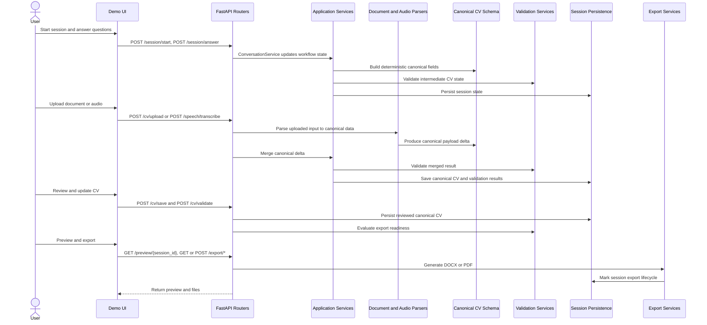

# Conversational CV Builder Automation

FastAPI-based CV builder platform with conversational intake, document and audio ingestion, canonical CV schema merge and validation, live preview, and export.

## Current Root Structure

		.
		|-p/
		|-- apps/
		|   |-- api/
		|   |-- worker/
		|-- config/
		|   |-- environments/
		|   |-- prompts/
		|   |-- questionnaire/
		|   |-- security/
		|   |-- templates/
		|-- data/
		|   |-- storage/
		|-- demo-ui/
		|-- deployments/
		|   |-- aca/
		|   |-- aks/
		|   |-- local/
		|   |-- scripts/
		|-- docs/
		|-- log/
		|-- scripts/
		|-- src/
		|-- tests/
		|-- Makefile
		|-- pyproject.toml
		|-- poetry.lock
		|-- run.py
		|-- __init__.py

## Key Directories

- apps/api: FastAPI app composition and startup.
- apps/worker: Worker bootstrap and queue/job placeholders.
- config: Runtime environments, prompt sets, questionnaire rules, security and templates.
- src: Domain, application, infrastructure, orchestration, and REST interfaces.
- demo-ui: Browser UI used by root endpoints.
- data/storage: Uploaded CV files, audio blobs, generated assets.
- deployments: Local docker and cloud deployment manifests/scripts.
- docs: Supporting assets currently in txt/sql format.
- log: Runtime logs and preview diagnostics.
- scripts: Utility and debug scripts.

## Run The Project

Main API app: apps/api/main.py

Convenience launcher:

		python run.py

Direct uvicorn run:

		uvicorn apps.api.main:app --host 0.0.0.0 --port 8000 --reload

## Project Architecture

The system is organized into four functional modules. All modules converge into a canonical CV payload stored per session.

### Module 1: Conversational Session Intake

Purpose:
- Ask guided questions.
- Build CV fields incrementally from text answers.
- Track session workflow and validation state.

Main components:
- session router
- chat router
- ConversationService
- CV builder services

### Module 2: Document Upload Ingestion

Purpose:
- Accept CV uploads.
- Parse documents into canonical schema.
- Merge with existing session data using precedence rules.

Main components:
- cv router upload endpoints
- DocumentCVService
- CanonicalDocumentParser
- SchemaMergeService

### Module 3: Audio Upload and Transcription

Purpose:
- Accept recorded/uploaded audio.
- Convert speech to transcript.
- Optionally improve transcript with LLM.
- Parse and merge into canonical CV.

Main components:
- speech router
- speech transcription service
- transcript enhancement service
- canonical audio parsing and merge pipeline

### Module 4: Review, Validation, Preview, Export

Purpose:
- Allow review and edits.
- Validate save/export readiness.
- Render preview.
- Export DOCX/PDF and mark export lifecycle.

Main components:
- cv review/save/validate endpoints
- validation router
- preview router
- export router

### Retrieval and FAISS Usage (Cross-Cutting)

Purpose:
- Provide context retrieval for conversational responses and assistance endpoints.
- Support vector-like search behavior for indexed chunks.

Current implementation:
- Retrieval pipeline uses `src/retrieval/indexing/index_service.py` and `src/retrieval/retrievers/contextual_retriever.py`.
- Vector store class is `src/retrieval/vectorstores/faiss_store.py`.
- The current `FAISSStore` is an in-memory lightweight implementation (token-match scoring) and acts as a FAISS-compatible placeholder.
- Enhanced RAG service includes FAISS mode references for future or extended indexing options.

## Data Flow Architecture

### 1) Upload Audio Recording Flow

		┌─────────────────────────────────────────────────────────────────┐
		│                     AUDIO INPUT FLOW                            │
		└─────────────────────────────────────────────────────────────────┘

		[Audio File or Recording]
						 │
						 ├─► Whisper or Speech Transcription
						 │         │
						 │         └─► Optional LLM Transcript Enhancement
						 │                      │
						 ▼                      ▼
			 [Raw Transcript]  ──►  [Enhanced Transcript]
						 │                      │
						 └──────────┬───────────┘
												│
												▼
						 ┌──────────────────────┐
						 │ CanonicalAudioParser │
						 │  Python NLP parsing  │
						 └──────────────────────┘
												│
												▼
						 ┌──────────────────────┐
						 │ Canonical CV Schema  │
						 │        v1.1          │
						 └──────────────────────┘
												│
												▼
						 ┌──────────────────────┐
						 │ SchemaMergeService   │
						 │ merge with session   │
						 └──────────────────────┘
												│
												▼
						 ┌──────────────────────┐
						 │ SchemaValidationSvc  │
						 │ save/export checks   │
						 └──────────────────────┘
												│
												▼
						 ┌──────────────────────┐
						 │ Session Storage      │
						 │ canonical + results  │
						 └──────────────────────┘
												│
												▼
							 [Temporary File Cleanup]

Short form:

		Voice or Audio Input
			↓
		Speech To Text
			↓
		Transcript Normalization
			↓
		Optional LLM Enhancement
			↓
		Python Field Extraction
			↓
		Canonical CV JSON
			↓
		Validation
			↓
		Session Persistence
			↓
		Preview and Export

### 2) Conversational Q and A Flow

		User Starts Session
			↓
		Question Selector Chooses First Prompt
			↓
		User Answer Submission
			↓
		Role Resolution and Follow-up Logic
			↓
		Deterministic CV Field Update
			↓
		Validation and Confidence Signals
			↓
		Session Save
			↓
		Next Question or Completion

### 3) Document Upload Flow

		CV File Upload
			↓
		Document Parser Extraction
			↓
		Canonical Mapping
			↓
		Schema Merge With Existing Session CV
			↓
		Validation
			↓
		Session Persistence
			↓
		Review, Preview, Export

### 4) Review to Export Flow

		Load Session Canonical CV
			↓
		User Edits in Review UI
			↓
		Save Endpoint Persists Changes
			↓
		Validation Endpoint Evaluates Export Readiness
			↓
		Preview Endpoint Renders Final Payload
			↓
		Export DOCX or PDF
			↓
		Mark Session As Exported

### 5) Retrieval and FAISS Context Flow

		Knowledge Documents and Prompt Assets
			↓
		Chunking and Embedding Service
			↓
		FAISSStore Indexing Layer
			↓
		Contextual Retriever
			↓
		/retrieval/context Endpoint
			↓
		Context Hints for Chat and Follow-Up Logic

## Active API Endpoint Groups

Mounted by apps/api/main.py:

- session
	- POST /session/start
	- POST /session/answer
	- GET /session/{session_id}
	- DELETE /session/{session_id}

- chat
	- POST /chat
	- POST /chat/conversations/session
	- GET /chat/conversations/{session_id}

- cv
	- GET /cv/{session_id}
	- PUT /cv/{session_id}
	- PUT /cv/review/{session_id}
	- POST /cv/{session_id}/validate
	- POST /cv/upload/document
	- GET /cv/status/{session_id}
	- GET /cv/edit/{session_id}
	- POST /cv/save
	- POST /cv/validate
	- POST /cv/upload
	- POST /cv/import

- speech
	- POST /speech/transcribe
	- POST /speech/correct

- preview
	- GET /preview/{session_id}

- validation
	- GET /validation/{session_id}

- retrieval
	- GET /retrieval/context

- export
	- GET /export/docx/{session_id}
	- GET /export/pdf/{session_id}
	- POST /export/docx
	- POST /export/pdf

## End-to-End Sequence Diagram



## Module-to-Folder Mapping

| Module | Responsibility | Main Folders and Files |
|---|---|---|
| Module 1: Conversational Session Intake | Guided questioning, role resolution, answer processing, session progression | apps/api/main.py, src/interfaces/rest/routers/session_router.py, src/interfaces/rest/routers/chat_router.py, src/application/services/conversation_service.py, src/questionnaire/ |
| Module 2: Document Upload Ingestion | CV document upload, parsing, canonical mapping, merge and save | src/interfaces/rest/routers/cv_router.py, src/application/services/document_cv_service.py, src/infrastructure/parsers/, src/domain/cv/services/ |
| Module 3: Audio Upload and Transcription | Audio upload, transcription, optional transcript correction, canonical extraction and merge | src/interfaces/rest/routers/speech_router.py, src/application/services/speech_service.py, src/infrastructure/parsers/, src/domain/cv/services/ |
| Module 4: Review, Validation, Preview, Export | Manual review, validation checks, preview rendering, DOCX and PDF export | src/interfaces/rest/routers/cv_router.py, src/interfaces/rest/routers/validation_router.py, src/interfaces/rest/routers/preview_router.py, src/interfaces/rest/routers/export_router.py, src/domain/export/ |
| Cross-Cutting: Retrieval and FAISS | Context indexing and retrieval for assistant support and knowledge lookup | src/interfaces/rest/routers/retrieval_router.py, src/retrieval/indexing/, src/retrieval/retrievers/, src/retrieval/vectorstores/faiss_store.py |

## Sample API Payloads

### Start Session

Request:

```http
POST /session/start
```

Response:

```json
{
	"session_id": "a15f5d1a-9f0c-4f84-a920-a74f7b5c02de",
	"question": "What is your full name?"
}
```

### Submit Answer

Request:

```json
POST /session/answer
{
	"session_id": "a15f5d1a-9f0c-4f84-a920-a74f7b5c02de",
	"answer": "I am a Senior Data Engineer with 9 years of experience."
}
```

Response:

```json
{
	"session_id": "a15f5d1a-9f0c-4f84-a920-a74f7b5c02de",
	"question": "What is your current role/title?",
	"cv_data": {
		"personal_details": {
			"full_name": "Venkata Janga"
		},
		"summary": {},
		"skills": {},
		"work_experience": [],
		"project_experience": [],
		"certifications": [],
		"education": [],
		"publications": [],
		"awards": [],
		"languages": [],
		"leadership": {},
		"target_role": null,
		"schema_version": "1.0"
	}
}
```

### Upload Document

Request:

```http
POST /cv/upload/document
Content-Type: multipart/form-data
file=<resume.pdf>
session_id=a15f5d1a-9f0c-4f84-a920-a74f7b5c02de
```

Response:

```json
{
	"session_id": "a15f5d1a-9f0c-4f84-a920-a74f7b5c02de",
	"canonical_cv": {
		"candidate": {},
		"skills": {},
		"experience": {},
		"education": []
	},
	"validation_results": {
		"can_save": true,
		"can_export": false,
		"errors": [],
		"warnings": []
	},
	"merge_stats": {
		"new_fields": 0,
		"updated_fields": 0,
		"preserved_fields": 0,
		"conflicts_resolved": 0
	},
	"message": "Document uploaded and processed successfully"
}
```

### Upload or Transcribe Audio

Request:

```http
POST /speech/transcribe
Content-Type: multipart/form-data
file=<recording.webm>
session_id=a15f5d1a-9f0c-4f84-a920-a74f7b5c02de
```

Response:

```json
{
	"raw_transcript": "Tech lead with 16 years of experience...",
	"normalized_transcript": "Tech lead with 16 years of experience...",
	"enhanced_transcript": "Tech Lead with 16 years of experience in enterprise application delivery...",
	"requires_correction": false,
	"extracted_cv_data": {},
	"session_id": "a15f5d1a-9f0c-4f84-a920-a74f7b5c02de",
	"canonical_cv": {
		"candidate": {},
		"skills": {},
		"experience": {},
		"education": []
	},
	"validation": {
		"can_save": true,
		"can_export": false,
		"errors": [],
		"warnings": []
	},
	"can_save": true,
	"can_export": false,
	"cv_data": {}
}
```

### Save Canonical CV

Request:

```json
POST /cv/save
{
	"session_id": "a15f5d1a-9f0c-4f84-a920-a74f7b5c02de",
	"canonical_cv": {
		"schemaVersion": "1.1.0",
		"candidate": {
			"fullName": "Alex Doe",
			"email": "alex@example.com",
			"currentLocation": {
				"city": "Pune",
				"country": "India"
			}
		},
		"skills": {
			"primarySkills": ["Java", "Spring Boot"]
		}
	}
}
```

Response:

```json
{
	"status": "success",
	"message": "CV changes saved successfully",
	"session_id": "a15f5d1a-9f0c-4f84-a920-a74f7b5c02de",
	"canonical_cv": {
		"schemaVersion": "1.1.0",
		"candidate": {
			"fullName": "Alex Doe",
			"email": "alex@example.com",
			"currentLocation": {
				"city": "Pune",
				"country": "India"
			}
		},
		"skills": {
			"primarySkills": ["Java", "Spring Boot"]
		}
	}
}
```

### Validate Canonical CV

Request:

```json
POST /cv/validate
{
	"session_id": "a15f5d1a-9f0c-4f84-a920-a74f7b5c02de",
	"canonical_cv": {
		"candidate": {
			"fullName": "Alex Doe"
		}
	}
}
```

Response:

```json
{
	"status": "success",
	"session_id": "a15f5d1a-9f0c-4f84-a920-a74f7b5c02de",
	"validation_results": {
		"errors": [],
		"warnings": [],
		"can_save": true,
		"can_export": false
	},
	"can_save": true,
	"can_export": false
}
```

### Preview CV

Request:

```http
GET /preview/a15f5d1a-9f0c-4f84-a920-a74f7b5c02de
```

Response:

```json
{
	"cv_data": {
		"header": {},
		"summary": {},
		"skills": {},
		"education": [],
		"project_experience": []
	},
	"preview": {
		"header": {},
		"summary": {},
		"skills": {},
		"education": [],
		"project_experience": []
	},
	"validation": {
		"errors": [],
		"warnings": [],
		"can_save": true,
		"can_export": false
	},
	"validation_result": {
		"errors": [],
		"warnings": [],
		"can_save": true,
		"can_export": false
	},
	"review_status": "pending",
	"has_user_edits": false,
	"source": "generated"
}
```

### Export DOCX

Request:

```http
GET /export/docx/a15f5d1a-9f0c-4f84-a920-a74f7b5c02de
```

Response:

```text
Binary DOCX stream with Content-Disposition attachment
```

## UI and Utility Routes

- GET /
- GET /index.html
- GET /styles.css
- GET /app.js
- GET /health

## Notes

- pyproject.toml references README.md as project readme.
- Root markdown files were consolidated; this is the current top-level markdown guide.
- tests directory exists, but test files were removed in cleanup.

## Main Dependencies

- fastapi
- uvicorn
- pydantic
- pydantic-settings
- python-docx
- PyPDF2
- reportlab
- pytest

## Optional Retrieval Stack Notes

- FAISS usage is represented by the `FAISSStore` abstraction under `src/retrieval/vectorstores/faiss_store.py`.
- Current repository implementation is an in-memory placeholder and does not require native faiss installation.
- If migrating to native FAISS, add `faiss-cpu` (or platform-appropriate FAISS package) and wire embedding vectors to a real FAISS index backend.
